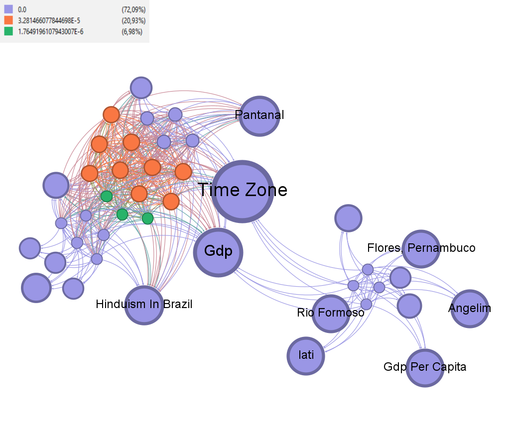

# Geração de Rede Dirigida da Wikipédia

Este projeto consiste na geração de uma rede dirigida baseada nos links das páginas do Wikipédia, empregando a fusão de quatro SEEDs distintas como páginas iniciais. As SEEDs selecionadas para este projeto são: Universidade Federal do Rio Grande do Norte, Natal (RN), Ciência dos Dados e Itapetim (PE).

O objetivo final é analisar e visualizar a rede resultante formada pelos links da Wikipédia, explorando as interconexões entre os tópicos abordados em cada uma dessas páginas iniciais, proporcionando uma compreensão mais ampla da estrutura de informações e inter-relações dentro do contexto definido pelas quatro SEEDs.

## Requisitos

### Requisito 1

Aqui, a principal abordagem adotada será a limitação do nível de profundidade da rede para 2. Esse processo implica na exploração das páginas vinculadas diretamente às SEEDs, bem como nas páginas associadas a essas primeiras conexões, formando uma rede que representa a estrutura de links dentro do contexto das quatro SEEDs que escolhi.

A escolha estratégica dessas quatro SEEDs foi feita considerando a diversidade de campos, geografias e interesses para ampliar a variedade e abrangência da rede resultante. A Universidade Federal do Rio Grande do Norte representa uma instituição de ensino superior, Ciência dos Dados um campo acadêmico, Natal (RN) uma capital brasileira e Itapetim (PE) uma cidade de menor porte.

Após unir cada rede em uma só, para tornar a rede mais fácil de manipular, foram removidos os nós duplicados (consideramos duplicados nós que possuem um hífen ou não e nós que estão no plural e no singular). Após isso, notamos que havia muitos nós com um grau baixo, ou seja, uma rede massiva com muitos nós com pouca relevância, para resolver isso, foram filtrados os nós com grau acima de três.

*Número alto de graus com pouca relevância na rede.*

#### Nós e Arestas
A rede resultante possuia antes da filtragem:
- **Número de Nós:** 23383 
- **Número de Arestas:** 199562

A rede resultante possui após a filtragem:
- **Número de Nós:** 12216 
- **Número de Arestas:** 177228

### Requisito 2

A partir da rede construída
e com o auxílio do Gephi. Foram geradas 4 imagens da rede de forma parcial, cada imagem valoriza e ilustra uma métrica de centralidade diferente, sendo eles: Betweenness, Closeness, Eigenvector e Degree. 

#### Betweenness Centrality

O betweenness centrality é uma medida de centralidade que avalia a importância de um nó na rede com base no número de vezes que esse nó atua como ponte mais curta entre outros pares de nós na rede.
É perceptível que vários nós apresentam o betweenness centrality igual a zero. Isso pode indicar a presença de múltiplas componentes desconectadas na rede, onde certos nós não fazem parte dos caminhos mais curtos entre diferentes regiões da rede. Algo relativamente esperado, visto que a natureza das SEEDs são bem distintas, de forma a abranger diferentes campos de estudo.
Dos nós em evidência (devido ao seu alto in-degree), podemos citar o GDP (Produto Interno Bruto) e o Time Zone, que conecta bem as duas cidades das SEEDs, e, de certa forma, a Universidade.

#### Closeness Centrality

A medida de closeness centrality avalia o quão próximo um nó está de todos os outros nós na rede. A maioria da rede possui um valor baixo de closeness, o que indica que os nós estão distantes, de todos os outros nós. Novamente, aqui recai o fator das SEEDs serem bastante distintas e diversas. Vale destacar duas situações presentes:  18,92% da rede possui um closeness de 0, o que indica que esses nós não conseguem alcançar nenhum outro nó na rede. E 3,78% possuem um closeness de 1, indicando que o nó pode alcançar diretamente qualquer outro nó na rede em um único passo, como é o caso do "National Symbols of Brazil".

#### Eigenvector Centrality

A centralidade de autovetor (eigenvector centrality) é uma medida de centralidade em uma rede que considera não apenas a importância dos vizinhos de um nó, mas também a importância desses vizinhos na rede. Na rede representada, a centralidade de autovetor é, majoritariamente baixa, podemos deduzir que o motivo é que a rede é descentralizada, ou seja, não possui nós fortemente conectados entre si. Porém, 26,47% da rede possui uma centralidade de autovetor de aproximadamente 0.61, o que indica que ainda há alguns nós mais importantes, denotando uma estrutura ligeiramente hirárquica.

#### Degree Centrality

A centralidade de grau (degree centrality) é uma medida fundamental de centralidade em redes e avalia a importância de um nó com base no número de conexões que ele possui na rede. Podemos notar que a quantidade de nós cai quando analisamos o grau deles de forma crescente, isso resulta em uma distribuição de grau onde alguns nós têm muitas conexões (hubs), enquanto outros têm poucas. Isso pode ser observado visualmente na imagem na formação das comunidades.

### Requisito 3

Um histograma de in-degree em uma rede é uma representação gráfica que mostra a distribuição da quantidade de nós conforme o número de conexões de entrada que cada nó possui. Cada barra no histograma representa um intervalo de valores de in-degree, e a altura da barra indica a frequência ou a quantidade de nós que possuem aquele número específico de conexões de entrada. É bastante útil para entender a distribuição da conectividade dos nós na rede, mostrando quais são os nós com mais ou menos conexões de entrada.
Aqui uma PDF (Probability Density Function) pode ser utilizada para modelar a distribuição de probabilidade dos diferentes valores de in-degree dos nós na rede. Ela fornece uma visão probabilística mais formal da distribuição dos graus na rede, permitindo entender a probabilidade de um nó específico ter um determinado número de conexões de entrada.
Complementando, a Cumulative Density Function (CDF) pode ser utilizada para compreender a acumulação de nós com um número menor ou igual de conexões de entrada. Isso permite analisar a distribuição acumulada dos graus na rede, mostrando, por exemplo, quantos nós têm um certo número de conexões de entrada ou menos.

*Histograma de quantidade de nós por seu grau de entrada em azul, acompanhado pela PDF em vermelho.*

*Histograma de quantidade de nós por seu grau de entrada em azul, acompanhado pela CDF em vermelho.*

Na imagem acima é perceptível que o histograma possui valor alto para in-degrees baixos, indicando uma rede com uma distribuição assimétrica, na qual a maioria dos nós possui um número muito pequeno de grau de entrada, enquanto apenas alguns nós têm um número significativo de grau de entrada. 
Em uma análise geral, as páginas com in-degrees altos são comparáveis aos "hubs" na rede, representando páginas altamente conectadas e influentes na Wikipedia. Porém, a maioria dos nós (páginas) com in-degrees baixos representa páginas menos referenciadas ou mais periféricas na estrutura da Wikipedia, talvez páginas sobre tópicos mais específicos ou menos conhecidos.

### Requisito 4

.png)
*Rede completa em cinza, destacando o k-core o k-shell.*

Um k-core é uma subestrutura da rede onde todos os nós têm pelo menos k conexões dentro do subgrupo. Eles representam uma parte altamente conectada e densa da rede, onde os nós têm conexões mais fortes entre si.O k-shell, por outro lado, refere-se a um conjunto de nós que têm pelo menos k conexões, mas essas conexões podem incluir também nós fora desse conjunto. Representam uma camada em torno do k-core, incluindo nós com um número mínimo de conexões, mas sem necessariamente formar um grupo densamente conectado entre si.
No caso, a rede apresentada, como pode ser visto na imagem acima, possui um 336-core e um 188-shell. Esses valores indicam áreas específicas da sua rede com diferentes níveis de densidade e conectividade. 
O 336-core revela uma parte altamente densa e fortemente conectada.Todas as páginas dentro desse núcleo têm um mínimo de 336 conexões, o que indica que elas estão fortemente relacionadas entre si. Essas páginas podem ser tópicos altamente centrais, abrangentes ou amplamente referenciados na Wikipedia. Por exemplo, páginas relacionadas à localidades, estudo de dados, institutos de ensino, etc., que recebem muitos links de várias outras páginas. 
Enquanto o 188-shell representa uma camada em torno desse núcleo com um nível menor de densidade, mas ainda assim significativo em termos de conexões, aqui poderiam ser páginas que, embora sejam importantes e tenham um número razoável de conexões, não estão entre os tópicos mais centrais ou amplamente referenciados na minha rede da Wikipedia.

### Requisito 5: Nome do Requisito 5

*Print do site que contém a rede completa, separada por comunidades.*

A rede completa pode ser vista no link a seguir.
- [LINK DA REDE](https://pedrorvn.github.io/wikipedia_network_deploy/network/)

## Créditos

Desenvolvido por:
- [Jordan Marques de Almeida Ramos](https://github.com/jordanmaramos)
- [Pedro Rêgo Vilar Neto](https://github.com/pedrorvn)
